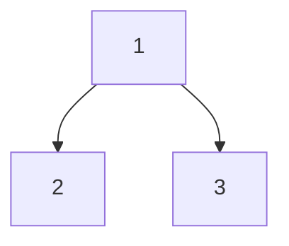

**Author:** Tinghai Zhang
**Last Update:** 2025 / 1 / 7
# 1. Binary Heaps
## 1.1 Priority Queue ADT
### 1.1.1 Requirements
There are some items with **priority**, and we need an ADT which supports:
- The next item to access or remove is the **highest-priority** item.
- New items may be added **any time**.
One of common use cases: Hospital Emergency Department.
### 1.1.2 Two Basic Implementation
- **(Unsorted) Array**
	- **Enqueue:** add new item at the end of the array, $\mathcal O(1)$
	- **Dequeue:** search for the highest-priority item from the beginning to the end, $\mathcal O(n)$
- **Sorted Array**
	- **Enqueue:** add new item where it keeps the array in priority order, $\mathcal O(n)$
	- **Dequeue:** take the last item in the array, $\mathcal O(1)$
Entirely unsorted is too chaotic, but entirely sorted is unnecessary.
## 1.2 Binary Heaps
Binary heaps store items **partially-sorted**.
All the items are stored in a **binary tree**, which satisfies:
- It is a **complete binary tree**, which means nodes in it are filled left-to-right on each level (row) of the tree.
	- It also means the tree can be easily stored in an array or vector.
- The nodes must satisfy **heap property**, which means if $x$ is a parent of $y$, then the priority of $x$ $\geqslant$ the priority of $y$.

```pseudo
\begin{algorithm}
	\caption{A Test Algorithm}
	\begin{algorithmic}
		\State $x\gets x+1$
    \end{algorithmic}
\end{algorithm}
```


